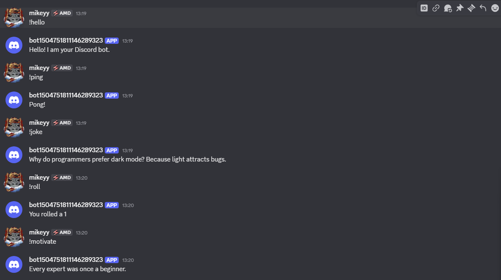
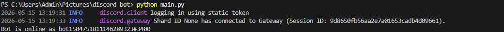

# Discord Bot Simulator using Python

This is a beginner-friendly Python chatbot project inspired by Discord bots.

The program works like a simple command-based bot where users can enter commands and receive different responses such as jokes, motivational quotes, greetings, and random dice rolls.

This project was built to practice Python fundamentals while creating an interactive command-line application.

---

## Features

- Simple command-based chatbot
- Greeting command
- Ping command
- Random joke generator
- Dice rolling feature
- Motivational quote command
- Beginner-friendly logic
- Interactive command-line interface

---

## Technologies Used

- Python
- random Module

---

## Python Concepts Practiced

Through this project, I practiced:

- Variables
- Loops
- Conditional Statements
- Lists
- User Input
- Randomization
- Basic Command Handling

---

## Project Structure

```bash
discord-bot-simulator/
│
├── main.py
├── README.md
├── output.png
└── commands.png
```

---

## How to Run the Project

1. Install Python on your system
2. Download or clone this repository
3. Open the project folder
4. Run the following command:

```bash
python main.py
```

---

## Available Commands

| Command   | Function           |
| --------- | ------------------ |
| !hello    | Sends greeting     |
| !ping     | Bot response       |
| !joke     | Random joke        |
| !roll     | Dice roll          |
| !motivate | Motivational quote |
| !exit     | Stops the bot      |

---

## Example Output

```text
===== Devansh Bot =====

Commands:
!hello
!ping
!joke
!roll
!motivate
!exit

Enter command: !roll

Bot: You rolled 4
```

---

# Screenshots

## Bot Commands



---

## Program Output



---

## Why I Built This Project

I built this project to practice Python fundamentals while creating an interactive chatbot application. This project helped me improve my understanding of loops, conditions, lists, randomization, and command handling in Python.

---

## Future Improvements

- Add more commands
- Add mini games
- Add chatbot conversation features
- Add GUI interface
- Add custom user commands

---

## Author

Devansh Rajoura
